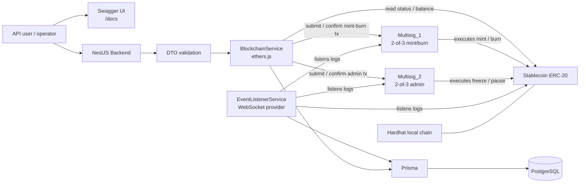

# Stablecoin & Custody PoC

This repository contains a Proof of Concept for an ERC-20 stablecoin developed on Ethereum Technology.

In following section we will find the entire structure of the project and the motivation under specific decisions on development side.

## Contents

- [Repository structure](#repository-structure)
- [Architecture](#architecture)
- [Smart contracts](#smart-contracts)
  - [Stablecoin](#stablecoin)
  - [Multisig contracts](#multisig-contracts)
- [Backend API](#backend-api)
- [API txId and multisig txId](#api-txid-and-multisig-txid)
- [Event persistence](#event-persistence)
- [Database model](#database-model)
- [Design choices and trade-offs](#design-choices-and-trade-offs)
  - [OpenZeppelin ERC-20](#openzeppelin-erc-20)
  - [Two multisigs instead of one](#two-multisigs-instead-of-one)
  - [Minimal multisig instead of Safe](#minimal-multisig-instead-of-safe)
  - [Auto-execution after the second confirmation](#auto-execution-after-the-second-confirmation)
  - [Immutable contract instead of proxy upgradeability](#immutable-contract-instead-of-proxy-upgradeability)
  - [Local Hardhat chain](#local-hardhat-chain)
  - [PostgreSQL and Prisma](#postgresql-and-prisma)
- [Security and compliance notes](#security-and-compliance-notes)
- [Local setup](#local-setup)
- [Testing](#testing)

## Repository structure

```text
smartcontract/
  Solidity contracts
  Hardhat 3 configuration
  Ignition deployment module
  Unit tests

backend/
  NestJS API
  ethers.js blockchain integration
  Prisma data layer
  PostgreSQL event store
  WebSocket event listener
  Swagger documentation
```

## Architecture



## Smart contracts

### Stablecoin

The `Stablecoin` contract is an ERC-20 token based on OpenZeppelin.

As requested following feature were implemented:

- ERC-20 standard token behavior;
- global pause through `ERC20Pausable`;
- account freeze/blacklist;
- role-based access control through OpenZeppelin `AccessControl`.

The role model is:

```text
MintBurnMultisig
  -> MINTER_ROLE
  -> BURNER_ROLE

AdminMultisig
  -> DEFAULT_ADMIN_ROLE
  -> PAUSER_ROLE
  -> FREEZER_ROLE
```

As requested no sensitive role is assigned directly to a single EOA.

The transfer restrictions are enforced by overriding OpenZeppelin v5’s `_update()` function. This is the central hook used by transfers, mint and burn, so the freeze and pause checks are applied consistently.

### Multisig contracts

To obtain what said earlier I have decide to deploy two separate 2-of-3 multisig contracts based on the separation of roles between mint/burn and freeze/pause:

```text
Multisig_1
  Used for mint and burn operations.

Multisig_2
  Used for admin operations such as freeze and pause.
```

The two multisigs use the same logic, but different signer sets can be configured at deployment. For our scenario we have taken the first 6 address generated by hardhat (first 3 as mint/burn administrators and last 3 as pause/freeze administrators).

A transaction submitted to a multisig works as follows:

1. an owner submits a target call;
2. the submission counts as the first confirmation;
3. a second valid owner confirms the same transaction;
4. once the threshold is reached, the multisig automatically executes the call.

## Backend API

The backend is implemented with NestJS, running on Node.js and TypeScript.

It exposes the endpoints required by the brief:

| Method | Endpoint            | Description                                                             |
| ------ | ------------------- | ----------------------------------------------------------------------- |
| `POST` | `/mint-request`     | Creates or confirms a mint proposal. KYC is mocked through `kycPassed`. |
| `POST` | `/burn-request`     | Creates or confirms a burn proposal.                                    |
| `POST` | `/freeze`           | Creates or confirms a freeze proposal through the admin multisig.       |
| `GET`  | `/status/:txId`     | Returns the current status of a proposal.                               |
| `GET`  | `/balance/:address` | Returns the stablecoin balance of an address.                           |

Given the specific requirements set out in the document, which called for these endpoints, and in order to avoid creating additional ones and deviating from the specifications, and as I did not have detailed information regarding the request bodies, I decided to use the POST endpoints both to create the first transaction and to confirm an existing one:

- If `txId` is not provided, the backend creates a new multisig proposal.

  Example:

  ```json
  {
    "to": "0x1111111111111111111111111111111111111111",
    "amount": "1000.50",
    "kycPassed": true,
    "signer": "owner1"
  }
  ```

- If `txId` is provided, the backend treats the request as an additional confirmation for an existing proposal.

  Example:

  ```json
  {
    "txId": "4f176c1e-9c30-49cc-bc15-0f2e9e8a38a6",
    "signer": "owner2"
  }
  ```

The backend does not mint, burn or freeze directly. It only prepares calldata and submits or confirms multisig transactions.

## API txId and multisig txId

The API returns a backend-level `txId`.

This is not the same thing as the internal multisig transaction id.

This distinction is needed because the system uses two multisig contracts (one for mint/burn and one for freeze/pause). Each multisig has its own internal transaction counter, so both contracts can have a transaction with id `0`.

For that reason, the backend stores a minimal mapping:

```text
api txId -> multisig kind + internal multisig txId
```

The database does not store transaction status as source of truth. Status, confirmations, execution state and calldata are read live from the multisig contracts.
I know this was not required from specification of the document, but It was the only way to separate two different transaction of the two different roles.

## Event persistence

The backend includes a WebSocket event listener.
It listens to events from:

- `Stablecoin`;
- `Multisig_1`; (mint/burn roles)
- `Multisig_2`. (pause/freeze roles)

Persisted events include:

- `Transfer`;
- `AccountFrozen`;
- `AccountUnfrozen`;
- `Paused`;
- `Unpaused`;
- `TransactionSubmitted`;
- `TransactionConfirmed`;
- `TransactionExecuted`.

Events are stored in PostgreSQL through Prisma.
The event table uses `(txHash, logIndex)` as a unique key. This makes event persistence idempotent and avoids duplicates if the listener receives the same log more than once.

## Database model

The database is intentionally small.
It is mainly used as an on-chain event store.
A minimal mapping table is also used to connect the API-level `txId` to the corresponding multisig transaction.

```text
ApiTxMapping
  id
  operationType
  multisigKind
  multisigTxId
  createdAt

ChainEvent
  id
  contractAddress
  eventName
  txHash
  blockNumber
  logIndex
  payload
  createdAt
```

No business-critical token state is stored off-chain as source of truth.
The blockchain remains the source of truth for everything.

## Design choices and trade-offs

### OpenZeppelin ERC-20

The ERC-20 implementation, pausing logic and access control are based on OpenZeppelin.
I chose this because token accounting and role checks are security-sensitive areas. Reusing standard, widely reviewed components is safer than implementing ERC-20 behavior manually.
The custom logic is limited to what is specific to the PoC:

- 6 decimals;
- freeze/unfreeze;
- role assignment to multisigs;
- transfer blocking for frozen accounts.

### Two multisigs instead of one

The PoC uses two multisig contracts instead of a single multisig with all roles.

This makes the separation between monetary operations and administrative operations explicit.

```text
Mint/burn multisig:
  controls token supply.

Admin multisig:
  controls freeze, pause and role administration.
```

The advantage is that compromising one signer group does not automatically grant every power in the system.

For example:

- mint/burn operators cannot freeze users;
- admin operators cannot mint new supply;
- role separation exists both in the smart contract and in the operational model.

The downside is slightly more complexity in the backend, because the backend must know which multisig to use for each operation and all the matter regarding the uuid to distinguish univocally a specific transaction and being able to serve the endpoints without inconsistencies from what was written on chain.

### Minimal multisig instead of Safe

The multisig is intentionally minimal.

I preferred a small custom implementation because it is easier to run locally, easier to test, and easier to explain during the walkthrough.

In a production environment I would not use this custom multisig.

I would use Safe or an institutional custody solution based on HSM/MPC, because production custody needs more than a threshold check. It needs better signer UX, monitoring, recovery procedures, transaction simulation, permission management, auditability and operational tooling.

### Auto-execution after the second confirmation

The multisig automatically executes a transaction as soon as the second valid owner confirms it.

This keeps the API aligned with the required endpoints. There is no additional `/execute` endpoint and I wanted to be as much as possible aligned with what was requested.

The trade-off is that there is no separate “ready to execute” phase. In a production multisig, I would probably keep confirmation and execution as separate actions. Reaching the approval threshold should not always mean immediate execution, especially for high-impact admin operations. A separate execution step, possibly protected by a timelock, gives the team time to review, detect mistakes or malicious proposals, and react before an irreversible action is applied on-chain.

### Immutable contract instead of proxy upgradeability

The stablecoin is deployed as an immutable contract.
I chose this deliberately for the PoC.
A proxy-based upgradeable design would make future changes easier, but it would also introduce a new and very sensitive attack surface.
With an upgradeable proxy, the system must protect:

- the proxy admin or upgrade role;
- the implementation address;
- the upgrade authorization logic;
- the storage layout between versions;
- the initializer logic;
- the upgrade process itself.

If the upgrade role is compromised, an attacker may be able to replace the implementation with malicious logic while keeping the same proxy address and storage. In practice, this can be worse than a normal smart contract bug because the attacker does not need to exploit a token function directly: they can change the code that the proxy delegates to.

There are also technical risks:

- storage layout mistakes can corrupt balances, roles or configuration;
- an unprotected initializer can allow someone to take ownership;
- a bad implementation can bypass existing access control;
- delegatecall-based proxy patterns are harder to reason about than immutable contracts;
- monitoring must cover not only token operations, but also upgrade events and implementation changes.

For a real stablecoin, upgradeability might still be useful, but only with strong governance around it:

- multisig or MPC-controlled upgrade role;
- timelock;
- explicit audit before upgrades;
- storage layout checks;
- public monitoring;
- rollback/emergency procedures.

For this specific case immutability is simpler and reduces governance risk.

### Local Hardhat chain

The PoC targets a local Hardhat chain.
This makes the demo deterministic and avoids external dependencies such as public testnet RPC instability, faucets or explorer verification delays.
For a real case hardhat is for sure not a possible option, I would consider an EVM-compatible L2 or a permissioned EVM network depending on the use case.
An L2 would reduce fees and improve UX. A permissioned network could make sense if the participants are regulated institutions and privacy/governance requirements are stronger than the need for public network composability.
Ethereum L1 would provide stronger settlement credibility, but it is probably not the most practical option for high-frequency stablecoin operations.

### PostgreSQL and Prisma

PostgreSQL is used because the backend needs a small but reliable persistence layer for on-chain events and API transaction mappings.
A document database such as MongoDB would also work for storing raw event payloads, especially because blockchain logs are naturally JSON-like. However, the data model in this PoC still has clear relational properties: an API transaction id maps to a specific multisig contract and an internal multisig transaction id, while event logs need uniqueness constraints such as `(txHash, logIndex)` to avoid duplicates. PostgreSQL makes these constraints explicit and reliable without adding much complexity.
Prisma is used as the ORM layer on top of PostgreSQL. The main advantage is that the database schema is defined in one place and exposed to the TypeScript code through a typed client. This reduces boilerplate, avoids hand-written SQL for simple CRUD operations, and makes the data model easier to review during the walkthrough.
The trade-off is that Prisma hides some SQL details and may be less flexible than raw queries for complex or highly optimized database operations. For this PoC, the queries are simple and type safety/readability matter more than low-level SQL control. If the system evolved into a data-heavy analytics platform, I would consider mixing Prisma with raw SQL for the parts that require more control or performance tuning.

## Security and compliance notes

### KYC

KYC is mocked with a boolean flag:

```json
{
  "kycPassed": true
}
```

In production, minting should depend on a real KYC/AML process and the result should be auditable. I would not store personal data on-chain. The blockchain should only receive the minimum information needed to enforce the operation.

### Backend authority

The backend is not a trust anchor.
If the backend is compromised, an attacker may be able to submit malicious proposals, but those proposals still need the multisig threshold to execute.
The backend should be treated as an orchestration layer, not as the authority that controls the stablecoin.

### Private keys in the PoC

For local demo purposes, signer private keys are loaded from environment variables.
This is acceptable just for making test, but other approaches should be for sure considered. Custody on .env file is just for testing.
In production, private keys should not live inside the application backend.
The backend should prepare the transaction intent, encode the calldata and track the request, but the actual signing flow should be delegated to a dedicated custody layer such as an HSM-backed signer, an MPC wallet infrastructure, a Safe-based approval process or a third-party institutional custody service.
For example, a `/mint-request` would not be signed directly with a key from `.env`. The backend would create the mint proposal and forward the signing request to the custody layer. The custody system would then enforce the required approval policy, collect the necessary approvals and submit the transaction only once the policy is satisfied.

This keeps the backend as an orchestrator, while the authority to approve and sign sensitive operations remains in a system designed specifically for key protection, approval management and auditability.

## Local setup

### Prerequisites

- Node.js 22+
- npm
- Docker

### Install dependencies

```bash
cd smartcontract
npm install

cd ../backend
npm install
```

### Start PostgreSQL

```bash
cd backend
docker compose up -d
```

### Configure backend environment

Create `backend/.env`:

```bash
cd backend
cp .env.example .env
```

### Run Prisma

```bash
cd backend
npm run prisma:generate
npm run prisma:migrate
```

### Start local blockchain and Deploy contracts

```bash
cd smartcontract
npm run deploy:local
```

This custom command enable to run /scripts/deploy_local.sh which is a very simple script to run hardhat blockchain and deploy at the same time.

The deployed addresses are available in:

```text
smartcontract/ignition/deployments/chain-31337/deployed_addresses.json
```

Copy those addresses into `backend/.env`.

Then the deployed smart contract abi have to be added on a specific backend path:

```bash
cd smartcontract
cp artifacts/contracts/Multisig_1.sol/Multisig_1.json artifacts/contracts/Stablecoin.sol/Stablecoin.json ../backend/src/abi
```

### Start backend

```bash
cd backend
npm run start:dev
```

Swagger UI:

```text
http://localhost:3000/docs
```

## Testing

To verify that the smart contracts behaved as expected in the key use cases outlined in the requirements (authorised/unauthorised minting,
freezing an account, pausing transfers, burning), I decided to write the tests directly in Hardhat, as this was the most straightforward way to check that the system was actually functioning at a low level. In future, it will certainly be necessary to introduce API-level tests
To run Smart contract tests:

```bash
cd smartcontract
npm run test
```
